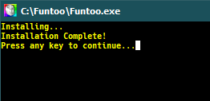

# Funtoo WSL

Funtoo WSL for Windows 10 WSL 1/WSL 2


## 💻Requirements

-   Windows 10 1709 Fall Creators Update 64bit or later.
-   Windows Subsystem for Linux feature is enabled.

**Note:**
Exe filename is using to the instance name to register.
If you rename it, you can register with a different name.

## 🔧Install with any Funtoo rootfs

#### 1. [Download Funtoo.exe](https://github.com/rescenic/FuntooWSL/releases)

#### 2. [Download Funtoo rootfs (tar.xz file) based on your computer processors (Subarches)](https://www.funtoo.org/Subarches)

(Ex: My CPU is Intel64 Sandybridge, So I choose: https://www.funtoo.org/Intel64-sandybridge then I choose stage3 file (tar.xz file)
https://build.funtoo.org/1.4-release-std/x86-64bit/intel64-sandybridge/2021-05-05/stage3-intel64-sandybridge-1.4-release-std-2021-05-05.tar.xz)

#### 3. Rename stage3-\*.tar.xz & convert it to rootfs.tar.gz using 7-Zip.

#### 4. Put your rootfs.tar.gz in same directory as Funtoo.exe (Installation directory)

#### 5. Run exe to install. This process may take a few minutes.



Note: You can distribute your distribution including wsldl exe.

## 📝How-to-Use(for Installed Instance)

#### exe Usage

```
Usage :
    <no args>
      - Open a new shell with your default settings.

    run <command line>
      - Run the given command line in that distro. Inherit current directory.

    runp <command line (includes windows path)>
      - Run the path translated command line in that distro.

    config [setting [value]]
      - `--default-user <user>`: Set the default user for this distro to <user>
      - `--default-uid <uid>`: Set the default user uid for this distro to <uid>
      - `--append-path <on|off>`: Switch of Append Windows PATH to $PATH
      - `--mount-drive <on|off>`: Switch of Mount drives
      - `--default-term <default|wt|flute>`: Set default terminal window

    get [setting]
      - `--default-uid`: Get the default user uid in this distro
      - `--append-path`: Get on/off status of Append Windows PATH to $PATH
      - `--mount-drive`: Get on/off status of Mount drives
      - `--wsl-version`: Get WSL Version 1/2 for this distro
      - `--default-term`: Get Default Terminal for this distro launcher
      - `--lxguid`: Get WSL GUID key for this distro

    backup [contents]
      - `--tgz`: Output backup.tar.gz to the current directory using tar command
      - `--reg`: Output settings registry file to the current directory

    clean -y
      - Uninstall the distro.

    help
      - Print this usage message.
```

#### First setup

```
# Fix network issues
# Delete auto-generated files
[root@PC-NAME user]# rm /etc/resolv.conf || true
[root@PC-NAME user]# rm /etc/wsl.conf || true

# Enable changing /etc/resolv.conf
# Enable extended attributes on Windows drives
[root@PC-NAME user]# cat <<EOF > /etc/wsl.conf
[network]
generateResolvConf = false

[automount]
enabled = true
options = "metadata"
mountFsTab = false
EOF

# Use google nameservers for DNS resolution
[root@PC-NAME user]# cat <<EOF > /etc/resolv.conf
nameserver 8.8.8.8
nameserver 8.8.4.4
EOF

[root@PC-NAME user]# epro show
[root@PC-NAME user]# ego sync
[root@PC-NAME user]# echo '=dev-lang/python-3.7*' >> /etc/portage/package.unmask
[root@PC-NAME user]# emerge '=dev-lang/python-3.7*'
[root@PC-NAME user]# echo '=dev-lang/python-2.7*' >> /etc/portage/package.unmask
[root@PC-NAME user]# emerge '=dev-lang/python-2.7*'
[root@PC-NAME user]# nano /etc/portage/make.conf
-----------------------------------------------------------------------------
# No GUI (-X -gtk), only english error messages (-nls)
USE="python -X -gtk -nls acl xml"

# Enable python 2.7 and set 3.7 as default
PYTHON_TARGETS="python2_7 python3_7"
PYTHON_SINGLE_TARGET="python3_7"

# Define targets for QEMU
QEMU_SOFTMMU_TARGETS="aarch64 arm i386 riscv32 riscv64 x86_64"
QEMU_USER_TARGETS="aarch64 arm i386 riscv32 riscv64 x86_64"

# No hardware videocard support
VIDEO_CARDS="dummy"

# Disable non-functional sandboxing features
FEATURES="-ipc-sandbox -pid-sandbox -mount-sandbox -network-sandbox"

# Always ask when managing packages, always consider deep dependencies (slow)
EMERGE_DEFAULT_OPTS="--ask --complete-graph"

# Enable optimizations for the used CPU
COMMON_FLAGS="-march=sandybridge -O2 -pipe"
CHOST="x86_64-pc-linux-gnu"
CFLAGS="${COMMON_FLAGS}"
CXXFLAGS="${COMMON_FLAGS}"
FCFLAGS="${COMMON_FLAGS}"
FFLAGS="${COMMON_FLAGS}"
MAKEOPTS="-j5"

# NOTE: This stage was built with the bindist Use flag enabled
## PKGDIR="/var/cache/portage/packages"
## PORTAGE_CONFIGROOT="/"
## PORTAGE_TMPDIR="/var/tmp"
## DISTDIR="/var/cache/portage/distfiles"
## PORTDIR="/usr/portage"

# This sets the language of build output to English.
# Please keep this setting intact when reporting bugs.
LC_MESSAGES=C
-----------------------------------------------------------------------------
[root@PC-NAME user]# epro build current
[root@PC-NAME user]# ego sync
[root@PC-NAME user]# emerge -auDN @world
-----------------------------------------------------------------------------
[root@PC-NAME user]# emerge vim
[root@PC-NAME user]# emerge app-arch/zstd
[root@PC-NAME user]# emerge app-misc/tmux
[root@PC-NAME user]# emerge app-shells/zsh
[root@PC-NAME user]# emerge --ask dev-vcs/git
[root@PC-NAME user]# sh -c "$(curl -fsSL https://raw.githubusercontent.com/ohmyzsh/ohmyzsh/master/tools/install.sh)"
[root@PC-NAME user]# git clone --depth=1 https://github.com/romkatv/powerlevel10k.git $ZSH_CUSTOM/themes/powerlevel10k
[root@PC-NAME user]# git clone https://github.com/zsh-users/zsh-autosuggestions.git $ZSH_CUSTOM/plugins/zsh-autosuggestions
[root@PC-NAME user]# git clone https://github.com/zsh-users/zsh-syntax-highlighting.git $ZSH_CUSTOM/plugins/zsh-syntax-highlighting
[root@PC-NAME user]# nano ~/.zshrc
-----------------------------------------------------------------------------
//edit those lines
export TERM="xterm-256color"
export PATH=$PATH:$HOME/.local/bin:$HOME/bin

# Path to your oh-my-zsh installation.
export ZSH="/root/.oh-my-zsh"

POWERLEVEL9K_MODE="nerdfont-complete"
ZSH_THEME="powerlevel10k/powerlevel10k"

# History in cache file:
HISTSIZE=10000
SAVEHIST=10000
HISTFILE=~/.zsh_history
//edit-done
-----------------------------------------------------------------------------
[root@PC-NAME user]# exit //exit Funtoo.exe

//Reopen Funtoo.exe
p10k configure automatically appears, set shell appearance as you want.

=============================================================================
INSTALL & FIX NEOFETCH
=============================================================================
emerge app-misc/neofetch or emerge '=app-misc/neofetch-9999'
-----------------------------------------------------------------------------
cat /etc/*release
cat /proc/version
nano /etc/*release
Add Funtoo in Pretty Name.
-----------------------------------------------------------------------------
```

#### Just Run exe

```cmd
>{InstanceName}.exe
[root@PC-NAME user]#
```

#### Run with command line

```cmd
>{InstanceName}.exe run uname -r
4.4.0-43-Microsoft
```

#### Run with command line with path translation

```cmd
>{InstanceName}.exe runp echo C:\Windows\System32\cmd.exe
/mnt/c/Windows/System32/cmd.exe
```

#### Change Default User(id command required)

```cmd
>{InstanceName}.exe config --default-user user

>{InstanceName}.exe
[user@PC-NAME dir]$
```

#### Set "Windows Terminal" as default terminal

```cmd
>{InstanceName}.exe config --default-term wt
```

#### How to uninstall instance

```cmd
>{InstanceName}.exe clean

```

## 🛠How-to-Build

Please see [DEVELOPERS.md](https://github.com/rescenic/FuntooWSL/blob/master/DEVELOPERS.md)

## 📄License

[MIT](https://github.com/yuk7/rescenic/FuntooWSL/master/LICENSES.md)

Copyright (c) 2017-2020 yuk7 <br/>
Copyright (c) 2020 Rescenic
